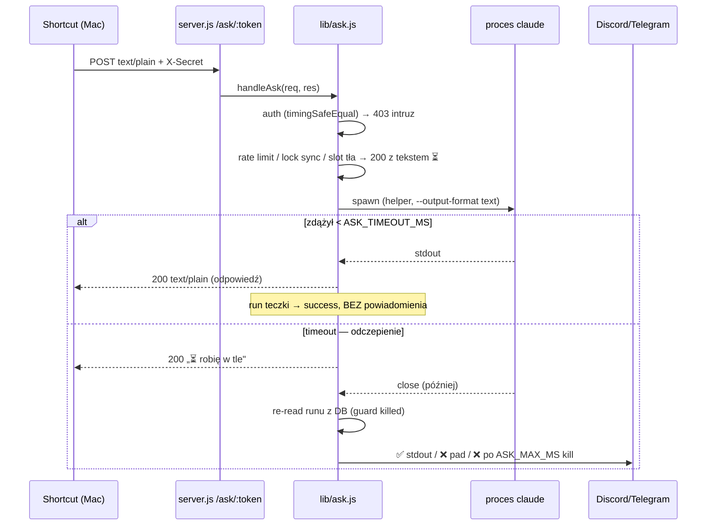

# feat: Endpoint /ask — asystent głosowy (faza 1, backend)

## Przegląd

Nowy publiczny endpoint `POST /ask/:token` w Pulsie: przyjmuje podyktowany tekst (text/plain), spawnuje CLI `claude` (Sonnet, `--output-format text`) z dostępem do vaulta i skilli, i zwraca odpowiedź **w tym samym połączeniu HTTP** (limit `ASK_TIMEOUT_MS` = 55 s). Zapytania za długie na sync są „odczepiane w tło" (proces żyje dalej, zero killa, zero podwójnych wykonań), a wynik wraca powiadomieniem Discord/Telegram wg konfiguracji dedykowanego joba-teczki „Asystent głosowy". Konsumentem jest Apple Shortcut na Macu (dyktowanie → HTTP → okno + odczyt głosem Zosia Enhanced).

Zakres tego planu = **serwer (świeży branch z `main`)**. Klikanie Shortcuta na Macu i faza 2 (Apple Watch) są poza kodem — patrz Operator checklist i Granice scope'u.

## Ujęcie problemu

User chce jednego skrótu głosowego do wszystkiego: pytania o vault, dodawanie zadań, odpalanie skilli (`/deleguj`, `/gog`, `/kie-generate`…). Istniejący webhook Pulsa (`handleWebhook`, `server.js:389-416`) odpowiada `{ok, run_id}` **zanim** Claude ruszy — wynik ląduje w SQLite, nie w odpowiedzi HTTP; webhook to skrzynka nadawcza, nie linia telefoniczna. `/ask` to osobne drzwi: synchroniczna odpowiedź, o trybie (ekran vs komunikator) rozstrzyga zegar, nie klasyfikacja w prompcie. (zob. źródło: docs/konspekt-endpoint-ask.md)

## Śledzenie wymagań

- R1. `POST /ask/:token` przyjmuje body text/plain i zwraca stdout Claude'a jako `200 text/plain; charset=utf-8` w tym samym połączeniu, gdy zdąży przed `ASK_TIMEOUT_MS`.
- R2. Autoryzacja podwójna: token w URL + sekret w headerze `X-Secret`, porównanie `crypto.timingSafeEqual` (z guardem długości bufora). Brak/niezgodność → `403` bez szczegółów. Kody błędów wyłącznie dla intruzów (403/404/405); **wszystko, co ma przeczytać człowiek, wraca jako `200` z tekstem** (Shortcuts na kodzie błędu gubi body).
- R3. Rate limit 10 zapytań/min per token, licznik in-memory; przekroczenie → `200` z tekstem rate-limitu.
- R4. Współbieżność: max 1 zapytanie sync (drugie równoległe → `200` „⏳ Jeszcze myślę nad poprzednim pytaniem"); max 3 zadania odczepione w tle. **Slot tła rezerwowany pesymistycznie przy spawnie** (każde zapytanie może się odczepić) — przy 3 zajętych slotach nowe zapytanie dostaje natychmiast `200` „⏳ Mam pełne ręce — poczekaj aż coś skończę", bez spawnu (decyzja usera 13.07, patrz Kluczowe decyzje).
- R5. Po `ASK_TIMEOUT_MS`: proces zostaje w spokoju (odczepienie, NIE kill+requeue), odpowiedź `200` „⏳ Za długie na szybką odpowiedź — robię w tle, wynik przyjdzie powiadomieniem"; stdout odczepionego procesu idzie po zakończeniu na kanały wg flag teczki.
- R6. Bezpiecznik: twardy limit życia `ASK_MAX_MS` (default 10 min) → kill drzewa procesów + ❌ na komunikator.
- R7. Gwarancja „nigdy cisza": zadanie odczepione kończy się ZAWSZE dokładnie jednym z: ✅ wynik / ❌ pad procesu lub `ASK_MAX_MS` / ❌ „przerwane przez restart serwera — poproś jeszcze raz" (reaper po restarcie; zwykłe runy `killed` nie powiadamiają — dla runów teczki jawnie włączone).
- R8. Job-teczka „Asystent głosowy": każde zapytanie `/ask` (także sync) = run teczki (`db.createRun`, trigger `ask`, poza kolejką schedulera) — pytanie, odpowiedź, czas, status; `routine=1` (retencja 24 h dla sukcesów); flagi `discord_notify`/`telegram_notify` teczki decydują o kanale. Powiadomienia TYLKO dla zadań odczepionych.
- R9. Spawn przez wspólny helper wydzielony z `executor.js` (strip env `CLAUDE_CODE*`/`CLAUDECODE`, wstrzyknięcie OAuth z `~/.claude-cron-oauth-token` PO stripie, `cwd = WORKSPACE_DIR`); dla ask: `--output-format text`, `--model <ASK_MODEL>` (default `sonnet`). Executor i ask używają tego samego helpera — zero duplikacji.
- R10. Konfiguracja w `lib/config.js`: `ASK_ENABLED` (default `false`), `ASK_TOKEN`, `ASK_SECRET`, `ASK_TIMEOUT_MS` (55000), `ASK_MAX_MS` (600000), `ASK_MODEL` (`sonnet`). Sekrety TYLKO w env na VPS — nic w repo.
- R11. Routing `/ask/:token` dopasowany PRZED guardem `X-Forwarded-For` (`server.js:438-444`), jak webhook; logowanie każdego wywołania w konsoli (jak `[webhook]`).
- R12. Testy wg sekcji E konspektu — asercje na TREŚĆ odpowiedzi (nie tylko kod, bo prawie wszystko to 200), w tym test szwu ask+reaper.

## Granice scope'u

- **Faza 2 (Apple Watch) — poza scope.** Przed nią obowiązkowy eksperyment pomiarowy cierpliwości zegarka (testowy endpoint czekający N s, wywołania LTE 20/30/45/60 s) i ewentualne obniżenie `ASK_TIMEOUT_MS` — osobne zadanie.
- **Apple Shortcut na Macu — poza kodem repo** (10 min klikania po działającym backendzie): Dyktuj → Pobierz zawartość URL → Okno dialogowe → Powiedz tekst (Zosia Enhanced). ElevenLabs świadomie odłożony (podmiana = jedna akcja w skrócie).
- **Bez klasyfikacji „długie vs krótkie" w prompcie** — o trybie odpowiedzi decyduje wyłącznie timeout serwera.
- **Bez serializacji ask vs joby Pulsa na vaulcie** — świadomie zaakceptowane ryzyko kolizji (roast 13.07); wracamy tylko, jeśli realnie zaboli.
- **Bez nowych ekranów w dashboardzie** — teczka to zwykły job w istniejącym panelu (jedyny dotyk frontu: etykieta triggera `ask` w `public/enum-map.js`).
- **Bez zmian sieci** — Funnel już wisi na `kacper.tail4f19b2.ts.net:8443`, endpoint jedzie tym samym portem.

## Kontekst i research

### Relevantny kod i wzorce

- **Routing publiczny przed guardem**: `matchWebhookToken` + `handleWebhook` matchowane w `server.js:432-436`, guard `X-Forwarded-For` → 403 w `server.js:438-444`. `/ask/:token` musi wejść dokładnie między nie.
- **Matcher tokenu**: `lib/webhook.js:5-11` — regex `/^\/webhook\/([a-zA-Z0-9_-]+)(?:\?|$)/` + guard typu; bliźniaczy wzorzec dla ask.
- **Spawn CLI**: `lib/executor.js:100-152` — argumenty, strip env `CLAUDE_CODE*`+`CLAUDECODE` (113-118), OAuth PO stripie (120-124, bo `CLAUDE_CODE_OAUTH_TOKEN` sam pasuje do prefiksu), `readOauthToken` wyeksportowany (`executor.js:24-33`, 413), Windows `where claude` bez `shell:true` (136-144), spawn `cwd: WORKSPACE_DIR`, `stdio:['ignore','pipe','pipe']`, `windowsHide:true` (146-152). Kill: `forceKillProc`/`gracefulKillProc` (172-186; Windows `taskkill /PID x /T /F`, Unix SIGTERM→SIGKILL po 5 s).
- **DB**: `createRun({job_id, trigger_type, webhook_payload})` → wiersz ze statusem `queued` (`db.js:293-299`); `updateRun(id, fields)` whitelist `status/started_at/finished_at/exit_code/stdout/stderr/error_msg` (`db.js:301-316`); `createJob` z defaultami — pusty `cron_expr` = scheduler nie planuje (`db.js:169-176`, `scheduler.js:58`); retencja `deleteOldRoutineRuns` kasuje tylko sukcesy jobów `routine=1` (`db.js:271-280`); `reapOrphanedRuns` (`db.js:326-333`) — goły UPDATE `running`→`killed`, wołany w `server.js:466-467`.
- **Statusy runów**: `queued`/`running`/`success`/`failed`/`timeout`/`killed`; źródło runu = kolumna `runs.trigger_type` (`scheduled`/`manual`/`webhook`/`wake`/`retry`) — dla ask nowa wartość `ask` + etykieta w `public/enum-map.js`.
- **Config**: konwencja `process.env.X || default` top-level, boolean opt-out jak `WEBHOOK_ENABLED = process.env.WEBHOOK_ENABLED !== '0'` (`config.js:42`) — uwaga: ASK_ENABLED ma odwrotny default (opt-in, `=== '1'`-style).
- **Powiadomienia**: `notifyRunOutcome` żyje w `executor.js:53-65` (killed NIGDY nie powiadamia — kontrakt schedulera, nie ruszać); `extractResult` (`notify-format.js:9-27`) parsuje **stream-json** — dla `--output-format text` bezużyteczny (zwróci fallback); `smartSplit` (`notify-format.js:31-57`) reużywalny dla plain text; kanały `discord.js`/`telegram.js` rozwiązują config w czasie wysyłki przez `resolveNotifyConfig` (`notify-config.js:26-32`).
- **Testy**: kolokacja `lib/X.test.js`, `node:test`+`node:assert/strict`, `db.setDbPath(':memory:')` w before, mock TYLKO granic sieci przez `t.mock.method(telegram, 'sendNotification', …)` (`executor.test.js:85-92`); spawn nie jest mockowany — realny `node <skrypt tmp>` (`scheduler.test.js:266-271`); wzorzec testu HTTP na żywym serwerze: `server.env.test.js:13-54` (spawn `node server.js` na efemerycznym porcie + `fetch`).
- **Idempotentny seed joba po `name`**: `lib/starter-jobs.js`.
- **Wzorzec „odczep i nie czekaj"**: caffeinate `spawn(..., {detached:true, stdio:'ignore'})` + `.unref()` (`executor.js:157-165`).

### Wiedza instytucjonalna

- **Stale obiekt vs stan DB** (`docs/solutions/runtime-errors/2026-07-03-stale-obiekt-w-pamieci-vs-stan-db-martwe-retry.md`, high): decyzje po zapisie wyniku podejmuj na świeżym odczycie runu z DB — close handler odczepionego procesu MUSI zrobić re-read przed policzeniem statusu (guard na `killed` ustawione przez usera/reaper). Założenie międzymodułowe (ask ↔ reaper) = obowiązkowy test szwu na `:memory:`, bo testy czystych funkcji obu stron przechodzą przy złamanym zachowaniu systemowym.
- **Backfill/seed w migrate() clobberuje decyzje usera** (`docs/solutions/runtime-errors/2026-06-27-backfill-w-migrate-clobberuje-opt-outy.md`, high): teczkę tworzyć leniwie i idempotentnie po `name` (wzorzec `starter-jobs.js`), NIGDY w `migrate()`; ponowne wywołanie nie może nadpisać zmienionych przez usera flag powiadomień.
- **Kolejność matcherów w ręcznym routerze to kontrakt** (`docs/solutions/performance-issues/2026-06-23-per-job-recent-runs-window-function.md`): `/ask/:token` świadomie przed guardem XFF; nie regresować window function przy dotykaniu warstwy runów. Ask-job o wysokiej kadencji to dokładnie profil „zjadacza okna" — retencja `routine=1` łagodzi, istniejące `ROW_NUMBER() OVER (PARTITION BY job_id …)` zostaje.
- **node:sqlite agregaty bywają BigInt** (`docs/solutions/runtime-errors/2026-06-29-migracja-better-sqlite3-na-node-sqlite.md`, high): liczniki współbieżności i rate limit trzymać czysto **in-memory** (jak `currentProcess` w executorze) — zero nowych agregatów SQL w `ask.js`.
- **Stale env w żywym procesie** (`docs/solutions/deployment-issues/2026-07-07-stale-env-vps-url-hook-respawn-serwera.md`, medium): `config.js` czyta env raz przy starcie — rotacja `ASK_TOKEN`/`ASK_SECRET` wymaga restartu daemona. Konspekt świadomie wybiera env-only dla sekretów (patrz Kluczowe decyzje) — udokumentować „rotacja = restart" w komunikacji deployowej.

### Referencje zewnętrzne

- Brak — research zewnętrzny pominięty: codebase ma silne lokalne wzorce (spawn, powiadomienia, testy, routing), a model bezpieczeństwa to świadoma decyzja z konspektu na poziomie ryzyka już akceptowanym dla webhooków.

## Kluczowe decyzje techniczne

- **Rezerwacja slotu tła przy spawnie (pesymistyczna)** — rozstrzygnięcie usera (AskUserQuestion, 13.07): każde zapytanie sync rezerwuje slot tła w momencie spawnu (bo każde może się odczepić); przy 3 zajętych slotach nowe zapytanie dostaje od razu „⏳ Mam pełne ręce" bez spawnu. Uzasadnienie: jedyny wariant spełniający naraz „zero killi po timeoucie" i twardy limit procesów; koszt (blokada sync przy 3 długich zadaniach) zaakceptowany jako skrajny stan. Slot zwalniany na `close` procesu (sync-finished, detached-finished lub kill po `ASK_MAX_MS`).
- **Sekrety w env, nie w state DB**: konspekt jawnie („Wartości tokenów/sekretów TYLKO w env na VPS"); świadome odstępstwo od wzorca `notify-config.js` — rotacja = edycja env + restart daemona (spójne z „podmiana modelu = restart").
- **Przyjazne komunikaty zawsze jako 200** (konspekt, sekcja B): Shortcuts gubi body przy kodach błędów. `403` tylko zła autoryzacja / `ASK_ENABLED=0` (jak webhook), `404`/`405` dla reszty intruzów. Konsekwencja: testy assertują treść, nie tylko kod.
- **Ask omija kolejkę schedulera i `notifyRunOutcome`**: run teczki prowadzony w całości przez moduł ask (create → running → wynik); `notifyRunOutcome`/`isFinalFailure` nietknięte (killed-bez-powiadomienia to kontrakt schedulera — zmiana regresowałaby ❌ po świadomym killu usera). Ask ma własną, prostą ścieżkę powiadomień plain-text tylko dla zadań odczepionych.
- **`--output-format text` zamiast stream-json**: czysty stdout do zwrotu; `extractResult` NIE ma zastosowania (parsuje stream-json) — do powiadomień idzie surowy stdout przez `smartSplit`.
- **Teczka = get-or-create po `name` przy pierwszym użyciu** (idempotentnie, wzorzec `starter-jobs.js`, POZA `migrate()`): `name: 'Asystent głosowy'`, `cron_expr: ''` (scheduler nie planuje), `routine: 1`, flagi powiadomień domyślnie 0 — user włącza kanał w panelu (krok deployowy). Ponowne wywołanie nie nadpisuje flag. Zmiana względem konspektu (deploy krok 4 „utworzyć w panelu"): tworzenie automatyczne eliminuje cichy pad, gdy joba brak; w panelu zostaje tylko konfiguracja kanału.
- **Nowy `trigger_type: 'ask'`** (kolumna to wolny TEXT) + etykieta w `public/enum-map.js`; pytanie usera zapisywane w istniejącej kolumnie `runs.webhook_payload` (bez migracji schematu), odpowiedź w `stdout`.
- **Statusy runów teczki bez nowych wartości enum**: `success` (sync i detached), `failed` (pad procesu), `timeout` (kill po `ASK_MAX_MS`), `killed` (tylko reaper po restarcie). Odczepienie NIE zmienia statusu — run jest `running` aż proces skończy.
- **Wspólny helper spawnu w nowym `lib/claude-spawn.js`**: czyste „zbuduj env + resolve binarki + spawn" z parametryzowanymi argumentami (executor: stream-json; ask: text+model). Stateful rzeczy (currentProcess, timeouty, watchdog, caffeinate, guard killed) ZOSTAJĄ w executorze — są splecione z kolejką i kill-barem UI. Testowalność: helper przyjmuje override binarki (wzorzec `db.setDbPath`), testy spawnują `node <skrypt tmp>` zamiast CLI claude.

## Otwarte pytania

### Rozwiązane podczas planowania

- Konflikt „max 3 w tle" vs „nie ubijaj" vs „tło nie blokuje sync": **rezerwacja pesymistyczna slotu przy spawnie** (decyzja usera, szczegóły wyżej).
- Kto tworzy teczkę: **serwer, get-or-create po `name`** (deploy krok „utworzyć w panelu" zredukowany do konfiguracji kanału powiadomień).
- Sekret w state DB czy env: **env** (jawna decyzja konspektu; odnotowany koszt „rotacja = restart").
- Format powiadomień z `--output-format text`: **surowy stdout + `smartSplit`**, z pominięciem `extractResult`.

### Odroczone do implementacji

- Dokładny kształt seamu plain-text w kanałach (nowa funkcja `sendPlain(job, text)` w `discord.js`/`telegram.js` vs eksport niżejpoziomowego senda) — widać dopiero w kodzie kanałów; wymaganie stałe: reuse `smartSplit` + `resolveNotifyConfig` w czasie wysyłki.
- Czy `ASK_MAX_MS` liczyć od spawnu czy od momentu odczepienia (różnica 55 s przy limicie 10 min — nieistotna produktowo; wybrać prostszy wariant i pokryć testem).
- Mechanika okna rate-limitu (sliding vs stały kubeł minutowy) — wybrać prostszą, kryterium: 11. zapytanie w minucie dostaje tekst rate-limitu.
- Dokładna treść template'u promptu asystenckiego (zwięzłość 2–4 zdania dla pytań, potwierdzenie jednym zdaniem dla poleceń) — szlif treści przy implementacji; kontrakt: BEZ klasyfikacji długie/krótkie.
- Weryfikacja realnego limitu czekania akcji „Pobierz zawartość URL" (55 s jest blisko typowych limitów) — test przy klikaniu Shortcuta, ewentualna korekta `ASK_TIMEOUT_MS` przez env (bez zmiany kodu).

## Implementation Units

- [x] **Unit 1: Wspólny helper spawnowania Claude — `lib/claude-spawn.js`**

**Cel:** Wydzielić z `executor.js:100-152` czyste elementy spawnu CLI claude do reużycia przez ask, bez zmiany zachowania executora.

**Wymagania:** R9

**Zależności:** Brak

**Pliki:**
- Stwórz: `lib/claude-spawn.js`
- Modyfikuj: `lib/executor.js`
- Test (unit): `lib/claude-spawn.test.js`

**Delegate to:** feature-builder-data

**Skills in play:** supabase-dev-guidelines, security, sentry-integration

**Podejście:**
- Helper obejmuje: budowę czystego env (strip `CLAUDE_CODE*`+`CLAUDECODE`, wstrzyknięcie OAuth przez istniejący `readOauthToken` PO stripie), resolve binarki (Windows `where claude` bez `shell:true`), spawn z `cwd: WORKSPACE_DIR`, `stdio:['ignore','pipe','pipe']`, `windowsHide:true`. Argumenty CLI przekazywane przez wywołującego (executor buduje swoje stream-json, ask swoje text+model).
- `readOauthToken` przenosi się do helpera (albo helper importuje z executora — wybrać kierunek bez cyklu importów; docelowo eksport z `claude-spawn.js`, executor re-eksportuje dla kompatybilności testów/instalatorów, jeśli coś go importuje).
- Override binarki dla testów (wzorzec `db.setDbPath`) — testy spawnują `node <skrypt tmp>`.
- W executorze ZOSTAJĄ: `currentProcess`/`currentRunId`, timeouty total/idle/watchdog, caffeinate, kill drzewa, guard killed, `notifyRunOutcome`.

**Notatka wykonawcza:** Refactor charakteryzacyjny — istniejące testy `lib/executor.test.js` i `lib/scheduler.test.js` muszą przejść bez modyfikacji asercji; to jest definicja „nie zepsułem executora".

**Wzorce do naśladowania:**
- `lib/executor.js:113-152` (dokładna kolejność strip→OAuth→spawn)
- `lib/db.js` `setDbPath` (wstrzykiwanie zależności dla testów)

**Scenariusze testowe:**
- [Unit] env po stripie nie zawiera żadnego klucza `CLAUDE_CODE*` ani `CLAUDECODE`, a zawiera `CLAUDE_CODE_OAUTH_TOKEN` gdy plik tokenu istnieje (kolejność strip→inject).
- [Unit] brak pliku OAuth (ENOENT) → spawn bez tokenu, bez wyjątku.
- [Unit] spawn z override binarki `node` + skrypt tmp zwraca stdout i kod wyjścia.
- [Unit] argumenty CLI przechodzą do procesu bez modyfikacji (echo argv w skrypcie testowym).

**Weryfikacja:**
- `npm test` przechodzi w całości — w tym istniejące `lib/executor.test.js` i `lib/scheduler.test.js` bez zmian asercji.
- `lib/claude-spawn.test.js` pokrywa scenariusze powyżej i przechodzi.

- [x] **Unit 2: Konfiguracja `ASK_*` i matcher tokenu**

**Cel:** Stałe konfiguracyjne feature'a i rozpoznawanie URL `/ask/:token` w stylu webhooka.

**Wymagania:** R10, R2 (część: token z URL), R11 (część)

**Zależności:** Brak

**Pliki:**
- Modyfikuj: `lib/config.js`, `lib/webhook.js`
- Test (unit): `lib/webhook.test.js`

**Delegate to:** feature-builder-data

**Skills in play:** supabase-dev-guidelines, security, sentry-integration

**Podejście:**
- `config.js`: sekcja `// Ask (asystent głosowy)` obok `// Webhooks` — `ASK_ENABLED` (**opt-in**: truthy tylko przy `'1'`, odwrotnie niż `WEBHOOK_ENABLED`), `ASK_TOKEN`, `ASK_SECRET` (stringi, brak defaultu), `ASK_TIMEOUT_MS` 55000, `ASK_MAX_MS` 600000, `ASK_MODEL` `'sonnet'`; wszystkie w `module.exports`.
- `webhook.js`: dodać `ASK_URL_PATTERN` + `matchAskToken(url)` bliźniacze do `matchWebhookToken` (moduł to już „matching tokenów z publicznych URL-i" — 13 linii, rozszerzenie nie łamie SRP).

**Wzorce do naśladowania:**
- `lib/config.js:41-43` (sekcja Webhooks), `lib/webhook.js:5-11`

**Scenariusze testowe:**
- [Unit] `matchAskToken('/ask/abc123?x=1')` → `'abc123'`; `/askk/…`, `/ask/`, nie-string → `null` (happy + error path).
- [Unit] defaulty config: `ASK_ENABLED` false bez env, `ASK_TIMEOUT_MS` 55000, `ASK_MODEL` `'sonnet'`.

**Weryfikacja:**
- `npm test` przechodzi; `lib/webhook.test.js` pokrywa nowy matcher.
- `node -e "const c=require('./lib/config'); process.exit(c.ASK_ENABLED===false && c.ASK_TIMEOUT_MS===55000 ? 0 : 1)"` kończy się kodem 0.

- [ ] **Unit 3: `lib/ask.js` — bramki wejścia i teczka**

**Cel:** Czyste, testowalne funkcje decyzyjne: autoryzacja, rate limit, współbieżność (1 sync + 3 tła z rezerwacją pesymistyczną) oraz get-or-create joba-teczki.

**Wymagania:** R2, R3, R4, R8 (część: teczka)

**Zależności:** Unit 2

**Pliki:**
- Stwórz: `lib/ask.js`
- Test (unit): `lib/ask.test.js`

**Delegate to:** feature-builder-data

**Skills in play:** supabase-dev-guidelines, security, sentry-integration

**Podejście:**
- Autoryzacja: `verifySecret(provided, expected)` — najpierw porównanie długości buforów (`timingSafeEqual` rzuca przy różnych), potem `crypto.timingSafeEqual`; brak konfiguracji (`ASK_TOKEN`/`ASK_SECRET` puste) = zawsze odmowa.
- Rate limiter i liczniki współbieżności czysto **in-memory** na poziomie modułu (wzorzec `currentProcess` w executorze; zero agregatów SQL — pułapka BigInt). Dla testowalności: stan enkapsulowany z funkcją reset/wstrzykiwanym zegarem (`now` jako argument, nie `Date.now()` w środku logiki decyzyjnej).
- Bramki w kolejności (konspekt B): auth → rate limit → lock sync (zajęty → tekst „⏳ Jeszcze myślę…") → slot tła (3 zajęte → tekst „⏳ Mam pełne ręce…"). Każda odmowa „dla człowieka" zwraca obiekt decyzji `{status: 200, text}` — mapowanie na HTTP robi Unit 5.
- `getOrCreateAskJob()`: szukaj po `name: 'Asystent głosowy'`, brak → `db.createJob({name, skill_name:'', cron_expr:'', routine:1, discord_notify:0, telegram_notify:0, …})`. NIGDY nie nadpisuje istniejącego (flagi usera święte — lekcja backfill-clobber).

**Wzorce do naśladowania:**
- `lib/starter-jobs.js` (idempotencja po `name`)
- czyste funkcje z argumentami zamiast globali (`computeMissedJobs`, `resolveNotifyConfig`)

**Scenariusze testowe:**
- [Unit] zły token / zły sekret / brak sekretu → decyzja 403 bez treści diagnostycznej (trzy przypadki).
- [Unit] sekrety o różnych długościach nie rzucają wyjątku (guard przed `timingSafeEqual`).
- [Unit] brak `ASK_TOKEN`/`ASK_SECRET` w konfiguracji → odmowa nawet przy „poprawnym" pustym sekrecie.
- [Unit] 10 zapytań w minucie przechodzi, 11. → `{status:200, text}` z tekstem rate-limitu; po przesunięciu zegara okno się odnawia.
- [Unit] drugi równoległy sync → tekst „jeszcze myślę"; po zwolnieniu locka kolejny przechodzi.
- [Unit] 3 zajęte sloty tła → nowe zapytanie dostaje „mam pełne ręce" BEZ spawnu; zwolnienie slotu odblokowuje.
- [Unit] `getOrCreateAskJob` woła dwa razy → jeden job; ręczna zmiana `telegram_notify=1` między wywołaniami NIE jest nadpisana.

**Weryfikacja:**
- `npm test` przechodzi; `lib/ask.test.js` pokrywa wszystkie powyższe scenariusze z asercjami na treść tekstów.

- [ ] **Unit 4: `lib/ask.js` — wykonanie zapytania: spawn, odczepienie, powiadomienia**

**Cel:** Pełny cykl życia zapytania: run teczki, spawn przez helper, odpowiedź sync albo odczepienie w tło, bezpiecznik `ASK_MAX_MS`, powiadomienia ✅/❌ wyłącznie dla zadań odczepionych.

**Wymagania:** R1, R5, R6, R7 (bez reapera — Unit 6), R8, R9

**Zależności:** Unit 1, Unit 3

**Pliki:**
- Modyfikuj: `lib/ask.js`, `lib/ask.test.js`
- Modyfikuj (seam plain-text, kształt odroczony): `lib/discord.js`, `lib/telegram.js` (+ ich testy `lib/discord.test.js`, `lib/telegram.test.js` jeśli seam tego wymaga)

**Delegate to:** feature-builder-data

**Skills in play:** supabase-dev-guidelines, security, sentry-integration

**Podejście:**
- Prompt = template asystencki (pytanie → 2–4 zdania czytane na głos; polecenie → wykonaj + potwierdź jednym zdaniem; BEZ klasyfikacji długie/krótkie) + tekst usera.
- Run: `db.createRun({job_id: teczka, trigger_type:'ask', webhook_payload: <pytanie>})` → od razu `updateRun` na `running` + `started_at` (ask omija kolejkę — run nigdy nie jest `queued` z perspektywy UI dłużej niż moment).
- Spawn helperem z Unit 1: `--dangerously-skip-permissions --output-format text --model <ASK_MODEL> -p <prompt>` (bez `--verbose` — to atrybut stream-json).
- Wyścig `close` vs `ASK_TIMEOUT_MS`: zdążył → `updateRun` (success/failed) + zwrot stdout do handlera; nie zdążył → handler odpowiada „⏳ robię w tle", proces zostaje (odczepienie logiczne — bez killa; slot tła już zarezerwowany od spawnu), kontynuacja na `close`.
- `close` odczepionego procesu: **re-read runu z DB przed zapisem** (guard: reaper/user mógł ustawić `killed` — wtedy nie nadpisywać i nie powiadamiać podwójnie); `updateRun` → success/failed; powiadomienie wg flag teczki: ✅ surowy stdout / ❌ komunikat pada — przez `smartSplit` + `resolveNotifyConfig` w czasie wysyłki, Z POMINIĘCIEM `extractResult` i `notifyRunOutcome`.
- `ASK_MAX_MS`: timer od spawnu; przekroczenie → kill drzewa (wzorzec `taskkill /T /F` / SIGTERM→SIGKILL z executora), run `timeout`, ❌ na komunikator.
- Gwarancja „nigdy cisza" strukturalnie: jedna funkcja kończąca zadanie odczepione (finalize), wołana z `close`, z killa `ASK_MAX_MS` — idempotentna (drugi call = no-op po sprawdzeniu stanu w DB), każda ścieżka kończy się dokładnie jednym powiadomieniem.
- Zapytania sync (zdążyły) NIE wysyłają powiadomień. Log konsolowy `[ask]` dla każdego wywołania.

**Wzorce do naśladowania:**
- `lib/executor.js:250-288` (close handler: re-read → status → updateRun → notify)
- `lib/notify-format.js` `smartSplit`; `lib/notify-config.js` (resolve w czasie wysyłki)

**Scenariusze testowe:**
- [Unit] happy path sync: skrypt-atrapa (node, override binarki) kończy się szybko → odpowiedź = stdout, run teczki `success` z pytaniem w `webhook_payload` i odpowiedzią w `stdout`, **zero** wywołań kanałów powiadomień.
- [Unit] odczepienie: skrypt śpi dłużej niż testowy `ASK_TIMEOUT_MS` → odpowiedź „robię w tle", proces NIE ubity (kończy pracę), po `close` run `success` + dokładnie jedno ✅ na zamockowanym kanale.
- [Unit] pad odczepionego procesu (exit≠0) → run `failed` + dokładnie jedno ❌.
- [Unit] przekroczenie `ASK_MAX_MS` (testowo małe) → proces ubity, run `timeout`, dokładnie jedno ❌.
- [Unit] `close` po tym, jak run został oznaczony `killed` w DB (symulacja reapera/usera) → brak nadpisania statusu, brak podwójnego powiadomienia (guard świeżego odczytu).
- [Unit] flagi teczki oba 0 → zadanie odczepione loguje warning zamiast cicho zgubić wynik (gwarancja „nigdy cisza" wymaga skonfigurowanego kanału — brak kanału to jedyny dopuszczalny „cichy" przypadek, jawnie zalogowany).

**Weryfikacja:**
- `npm test` przechodzi; scenariusze powyżej w `lib/ask.test.js` z mockami wyłącznie na kanałach (`t.mock.method(discord/telegram, …)`), spawn realny przez `node` + skrypty tmp.

- [ ] **Unit 5: Endpoint `POST /ask/:token` w `server.js` + etykieta triggera**

**Cel:** Wpiąć ask w router HTTP: surowe body text/plain, pozycja przed guardem `X-Forwarded-For`, kody dla intruzów, odpowiedzi text/plain; etykieta `ask` w UI.

**Wymagania:** R1, R2 (kody), R11

**Zależności:** Unit 3, Unit 4

**Pliki:**
- Modyfikuj: `server.js`, `public/enum-map.js`
- Test (unit): `lib/ask.http.test.js` (test HTTP na żywym serwerze, wzorzec `server.env.test.js`)
- Modyfikuj (jeśli enum-map ma testy): `public/enum-map.test.js`

**Delegate to:** feature-builder-data

**Skills in play:** supabase-dev-guidelines, security, sentry-integration

**Podejście:**
- Match `matchAskToken(req.url)` dokładnie między blokiem webhooka (`server.js:436`) a guardem XFF (`server.js:438`) — komentarz po polsku wyjaśniający kontrakt kolejności.
- Handler: `ASK_ENABLED` false → 403; nie-POST → 405; zły token/sekret → 403 `{error}` bez szczegółów.
- Body: własny reader surowego tekstu (istniejący `parseBody`, `server.js:40-49`, zawsze JSON-uje i cicho zwraca `{}` — nie nadaje się); puste body → 200 z przyjaznym tekstem „nic nie usłyszałem".
- Odpowiedzi sukcesu i wszystkie ⏳ jako `200` z `Content-Type: text/plain; charset=utf-8` (pierwsze użycie text/plain w serwerze — helpery `json`/`error` zostają nietknięte).
- `public/enum-map.js`: etykieta triggera `ask` (spójna z istniejącymi wpisami cron/webhook/manual/wake/retry).

**Wzorce do naśladowania:**
- `server.js:389-416` (`handleWebhook` — gate/405/log), `server.js:432-444` (pozycja w routerze)
- `server.env.test.js:13-54` (spawn serwera na efemerycznym porcie + `fetch`)

**Scenariusze testowe:**
- [Unit] POST bez `X-Secret` / ze złym sekretem / ze złym tokenem → 403 (trzy przypadki, body bez szczegółów).
- [Unit] `ASK_ENABLED` niewłączony → 403 nawet z poprawnymi sekretami.
- [Unit] GET na `/ask/<token>` → 405.
- [Unit] happy path E2E po HTTP: poprawny POST text/plain (serwer z env: override binarki na skrypt-atrapę, testowe `ASK_TOKEN`/`ASK_SECRET`) → 200, `Content-Type: text/plain; charset=utf-8`, body = stdout atrapy; run teczki widoczny przez `GET /api/runs`.
- [Unit] request z nagłówkiem `X-Forwarded-For` na `/ask/<token>` przechodzi (publiczny), a na `/api/jobs` dalej 403 (guard nienaruszony — regresja kolejności matcherów).
- [Unit] drugi równoległy POST → 200 z tekstem „jeszcze myślę" (asercja na treść).

**Weryfikacja:**
- `npm test` przechodzi; `lib/ask.http.test.js` pokrywa scenariusze powyżej na żywym procesie serwera.
- Lokalny smoke curlem (jak w konspekcie E) zwraca odpowiedź text/plain — pokryty przez test HTTP happy path.

- [ ] **Unit 6: Reaper — ❌ „przerwane przez restart" dla runów teczki + test szwu**

**Cel:** Domknąć gwarancję „nigdy cisza": po restarcie serwera osierocone runy teczki (odczepione zadania przerwane restartem) dostają ❌ na komunikator; zwykłe runy `killed` dalej milczą.

**Wymagania:** R7

**Zależności:** Unit 4, Unit 5

**Pliki:**
- Modyfikuj: `lib/db.js` (`reapOrphanedRuns` zwraca zebrane runy, nie tylko `changes`), `server.js` (start), `lib/ask.js` (funkcja powiadomienia o przerwaniu)
- Test (unit): `lib/ask.test.js` (test szwu ask+reaper), `lib/db.test.js` (nowy kształt zwrotki reapera)

**Delegate to:** feature-builder-data

**Skills in play:** supabase-dev-guidelines, security, sentry-integration

**Podejście:**
- `reapOrphanedRuns`: `SELECT` osieroconych przed `UPDATE` (albo `UPDATE … RETURNING`) → zwraca listę `{id, job_id}`; istniejący log w `server.js:466-467` bez zmian semantyki dla zwykłych jobów.
- Po reap na starcie: runy należące do teczki ask → ❌ „przerwane przez restart serwera — poproś jeszcze raz" wg flag teczki (fire-and-forget z catch, jak `notifyRunOutcome` — pad powiadomienia nie może blokować startu serwera).
- Kontrakt schedulera nienaruszony: `notifyRunOutcome`/`isFinalFailure` nietknięte; powiadomienie o przerwaniu żyje w module ask, wywoływane jawnie ze startu serwera.

**Notatka wykonawcza:** Test szwu ask+reaper jest sednem tego unitu (lekcja z `2026-07-03-stale-obiekt…`): testy czystych funkcji obu stron przechodzą przy złamanym zachowaniu systemowym — pisz test integracyjny na `:memory:` PRZED podłączeniem do `server.js`.

**Wzorce do naśladowania:**
- `lib/db.js:326-333` + `server.js:466-467` (obecny kształt reapera)
- `executor.js:285` (fire-and-forget notify z `.catch`)

**Scenariusze testowe:**
- [Unit] `reapOrphanedRuns` zwraca listę zebranych runów z `job_id`; brak osieroconych → pusta lista (happy + edge).
- [Unit] test szwu: run teczki `running` w DB (symulacja odczepionego zadania sprzed restartu) → reap + logika startowa → run `killed`, dokładnie jedno ❌ na zamockowanym kanale z tekstem o restarcie.
- [Unit] osierocony run ZWYKŁEGO joba → reap bez żadnego powiadomienia (kontrakt `killed`-milczy zachowany).

**Weryfikacja:**
- `npm test` przechodzi; test szwu w `lib/ask.test.js` i zwrotka reapera w `lib/db.test.js` pokrywają scenariusze powyżej.

**Operator checklist:** *(kroki deployowe i Shortcut — poza automatyzacją)*
- [ ] Deploy: merge do `main`, pull na VPS, `ASK_*` do env (wygenerować długie losowe `ASK_TOKEN`/`ASK_SECRET`), restart daemona; sprawdzić, że `~/.claude-cron-oauth-token` przeżył.
- [ ] W panelu Pulsa włączyć kanał powiadomień (Telegram lub Discord) na jobie „Asystent głosowy" (job powstaje automatycznie przy pierwszym `/ask`).
- [ ] Test curlem z innej maszyny przez Funnel (poprawny sekret → odpowiedź; bez sekretu → 403).
- [ ] Zbudować Shortcut „Asystent" na Macu (Dyktuj → Pobierz zawartość URL → Okno dialogowe → Powiedz tekst Zosia Enhanced); przy okazji zmierzyć realny limit czekania akcji „Pobierz zawartość URL" i w razie potrzeby obniżyć `ASK_TIMEOUT_MS` w env.
- [ ] Wybrać hotkey (Shortcuts.app/Raycast) i tryb dyktowania (Apple vs VoiceInk) — decyzje przy klikaniu.

## Wpływ systemowy

- **Graf interakcji:** nowy route publiczny w ręcznym routerze (`server.js`) — kolejność matcherów to kontrakt (webhook → ask → guard XFF → api/static). `lib/ask.js` zależy od: `claude-spawn` (nowy), `db`, `webhook` (matcher), `discord`/`telegram`/`notify-format`/`notify-config`, `config`. Executor zależy od `claude-spawn` po refaktorze. Zero cykli: `ask` nie importuje `executor`, `scheduler` nie wie o ask.
- **Propagacja błędów:** błędy „ludzkie" spłaszczane do 200+tekst na granicy HTTP; pad procesu odczepionego → ❌ powiadomienie (nigdy wyjątek do routera); pad samego powiadomienia → log, nie crash (fire-and-forget z catch). Catch-all 500 w serwerze (`server.js:451-454`) zostaje ostatnią siatką.
- **Ryzyka cyklu życia stanu:** trzech potencjalnych pisarzy statusu runu teczki (close handler odczepionego procesu, reaper po restarcie, przyszły kill) — rozstrzygane świeżym odczytem z DB przed każdym zapisem + idempotentny finalize. Liczniki in-memory (sync lock, sloty, rate limit) zerują się przy restarcie — spójne z rzeczywistością (procesy odczepione giną z serwerem, reaper domyka ich runy).
- **Parytet surface API:** proxy `/api/vps/*` nie dotyka `/ask` (endpoint wołany bezpośrednio przez Funnel na VPS) — bez zmian. Dashboard pokazuje runy teczki przez istniejące `GET /api/runs` (nowy `trigger_type` wymaga tylko etykiety w `enum-map.js`).
- **Pokrycie integracyjne:** test szwu ask+reaper (Unit 6) i test HTTP na żywym serwerze (Unit 5) — dokładnie te scenariusze, których testy czystych funkcji nie udowodnią.

## Ryzyka i zależności

- **Limit cierpliwości Shortcuts nieznany dokładnie** (55 s blisko granicy) — zmitigowane: `ASK_TIMEOUT_MS` przez env, pomiar w Operator checklist; fallback „robię w tle" i tak istnieje.
- **Proces odczepiony przeżywa restart serwera jako sierota OS-owa** — jego wynik przepada (nikt nie słucha `close`), user dostaje ❌ „poproś jeszcze raz"; jeśli sierota zdążyła wykonać side-effecty, ponowna prośba może je zduplikować. Świadomie zaakceptowane (skrajny przypadek: restart w trakcie długiego polecenia z side-effectami).
- **Wysoka kadencja runów teczki** — łagodzona `routine=1` (sukcesy >24 h znikają, ukryte z listy/statystyk) + istniejące window function per job.
- **Rotacja sekretów wymaga restartu daemona** (env czytane raz) — udokumentowane; akceptowalne przy poziomie ryzyka jak webhooki.
- **Refactor executora (Unit 1) na żywym sercu systemu** — zmitigowany charakteryzacyjnie: zero zmian w istniejących testach executora/schedulera.
- **Równoległość ask ↔ joby Pulsa na tym samym vaulcie** — zaakceptowana w konspekcie (roast 13.07); nie budujemy serializacji na zapas.

## Dokumentacja / Notatki operacyjne

- Po implementacji: dopisać `/ask` do sekcji „server.js — HTTP i granice bezpieczeństwa" i `lib/ask.js`+`lib/claude-spawn.js` do „Architektura backendu" w `CLAUDE.md` (konwencja repo: architektura modułów żyje tam).
- Deploy i konfiguracja kanału — patrz Operator checklist w Unit 6; sieć bez zmian (Funnel na `kacper.tail4f19b2.ts.net:8443`).
- W razie podejrzenia wycieku: zrotować `ASK_TOKEN`/`ASK_SECRET` w env i zrestartować daemona.
- Faza 2 (Watch): przed nią eksperyment pomiarowy z konspektu (testowy endpoint N-sekundowy + LTE) — osobny plan.

## Źródła i referencje

- **Dokument źródłowy:** [docs/konspekt-endpoint-ask.md](../konspekt-endpoint-ask.md) (wersja po sesji roast 13.07.2026)
- Powiązany kod: `server.js:389-455`, `lib/executor.js:100-152`, `lib/webhook.js`, `lib/db.js:169-343`, `lib/notify-format.js`, `lib/notify-config.js`, `lib/starter-jobs.js`
- Wiedza instytucjonalna: `docs/solutions/runtime-errors/2026-07-03-stale-obiekt-w-pamieci-vs-stan-db-martwe-retry.md`, `docs/solutions/runtime-errors/2026-06-27-backfill-w-migrate-clobberuje-opt-outy.md`, `docs/solutions/performance-issues/2026-06-23-per-job-recent-runs-window-function.md`, `docs/solutions/runtime-errors/2026-06-29-migracja-better-sqlite3-na-node-sqlite.md`, `docs/solutions/deployment-issues/2026-07-07-stale-env-vps-url-hook-respawn-serwera.md`
